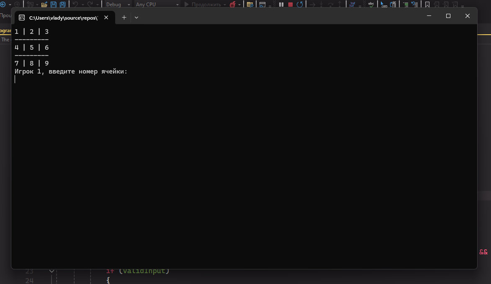

ы
# 🎲The game of Tic Tac Toe 
<h2>👋 Hello. This is a tic-tac-toe game, the source code was taken from this site.

[site](https://itproger.com/tasks/zadacha-po-yaziku-c-igra-krestiki-noliki-v-konsoli)

I wrote this game for learning and learning the C# programming language.</h2>

# 🎮Screenshots of the game

